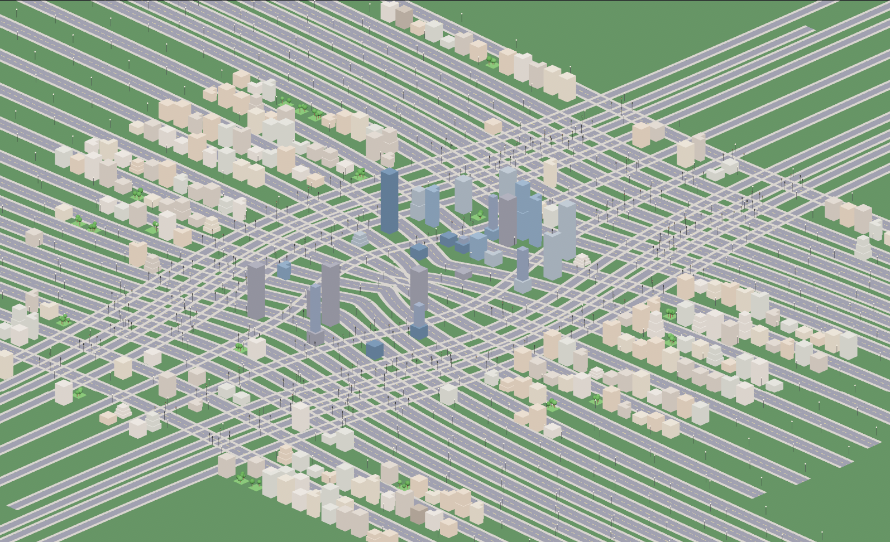

# Urban Sprawl

A large-scale procedural city simulator built with [Bevy](https://bevyengine.org/) (Rust).


## Overview

Urban Sprawl generates infinite, organic city layouts using tensor field-based road networks and procedural building placement. The project targets 100,000+ rendered entities at 60 FPS using Bevy's ECS architecture and hardware instancing.



## Features

### City Generation
- **Tensor Field Road Generation** - Organic road networks using grid and radial basis field blending, traced via streamline integration
- **Procedural Buildings** - Multiple building shapes (box, L-shape, tower-on-base, stepped) with zone-based placement and 5 facade styles (Glass, Brick, Concrete, Metal, Painted)
- **Water System** - Procedural rivers with meandering paths, animated water shader, and automatic bridge placement
- **Green Spaces** - Parks with procedurally placed trees and street trees lining sidewalks

### Visual Details
- **Day/Night Cycle** - Dynamic sun lighting with smooth transitions
- **Facade-Aware Windows** - Building windows vary by architectural style with night-time illumination
- **Rooftop Details** - AC units, water towers, antennas on building rooftops
- **Tilt-Shift Effect** - Post-processing for miniature/diorama aesthetic
- **Cloud Shadows** - Drifting shadows using procedural noise

### City Life
- **Moving Vehicles** - Cars driving on roads with traffic light awareness
- **Pedestrians** - Citizens walking on sidewalks between intersections
- **Street Furniture** - Lamps, traffic lights, fire hydrants, benches, parked cars

### Technical
- **Orthographic Camera** - Zoom, pan, and rotate controls for city exploration
- **Terrain System** - Perlin noise height variation with all objects following terrain

## Getting Started

### Prerequisites

- [Rust](https://rustup.rs/) 1.75 or later
- Vulkan-compatible GPU (DirectX 12 on Windows has known issues)

### Installation

```bash
git clone https://github.com/bneidlinger/urban_sprawl.git
cd urban_sprawl
cargo run
```

First build will take several minutes as Bevy compiles. Subsequent builds are fast due to dynamic linking.

### Controls

| Input | Action |
|-------|--------|
| WASD / Arrow Keys | Pan camera |
| Middle/Right Mouse + Drag | Pan camera |
| Mouse Wheel | Zoom in/out |
| Q / E | Rotate camera |

## Architecture

The project uses Bevy's plugin system with a staged generation pipeline:

```
TensorField → RoadGraph → CityBlocks → Buildings/Parks
     ↓            ↓            ↓
  Basis      Road Meshes   Street Furniture
  Fields     + Sidewalks   (Lamps, Lights)
```

See [CLAUDE.md](CLAUDE.md) for detailed architectural documentation.

## Roadmap

### Completed
- [x] Tensor field road generation
- [x] Building spawning with shape variety and facade styles
- [x] Parks and green spaces with street trees
- [x] Street furniture (lamps, traffic lights, hydrants, benches)
- [x] Day/night cycle with dynamic lighting
- [x] Moving vehicles with traffic light awareness
- [x] Pedestrians walking on sidewalks
- [x] Water system with rivers and bridges
- [x] Facade-aware windows with night illumination
- [x] Rooftop details (AC units, antennas, water towers)
- [x] Tilt-shift post-processing effect
- [x] Cloud shadows

### In Progress
- [ ] Weather system (fog, rain)
- [ ] Public transit (buses, trains)
- [ ] Landmark buildings

### Planned
- [ ] Full traffic simulation with pathfinding
- [ ] Citizen agents with daily schedules
- [ ] Economic simulation
- [ ] City growth over time

## References

This project implements techniques from:

- [Interactive Procedural Street Modeling](https://www.sci.utah.edu/~chengu/street_sig08/street_sig08.pdf) - Chen et al. 2008
- [Procedural Modeling of Buildings](http://peterwonka.net/Publications/pdfs/2006.SG.Mueller.ProceduralModelingOfBuildings.final.pdf) - Mueller et al. 2006

## License

This project is licensed under the MIT License - see [LICENSE](LICENSE) for details.

## Contributing

Contributions are welcome! Please read [CONTRIBUTING.md](CONTRIBUTING.md) before submitting PRs.
